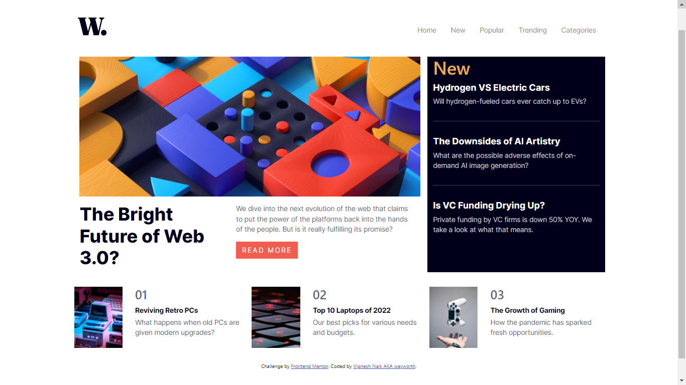

# Frontend Mentor - News homepage solution

This is a solution to the [News homepage challenge on Frontend Mentor](https://www.frontendmentor.io/challenges/news-homepage-H6SWTa1MFl). Frontend Mentor challenges help you improve your coding skills by building realistic projects. 

## Table of contents

- [Overview](#overview)
  - [The challenge](#the-challenge)
  - [Screenshot](#screenshot)
  - [Links](#links)
  - [Built with](#built-with)
  - [What I learned](#what-i-learned)
  - [Continued development](#continued-development)
- [Author]

## Overview
The challenge to build this web page was fun, challenging indeed and very knowledgeable to me.
### The challenge

Users should be able to:

- View the optimal layout for the interface depending on their device's screen size
- See hover and focus states for all interactive elements on the page

### Screenshot

### Links

- Solution URL: [solution here](https://github.com/VIGNESHx/news-homepage-challenge)
- Live Site URL: [view site here](https://vigneshx.github.io/news-homepage-challenge/)

## My process

### Built with

- Semantic HTML5 markup
- CSS custom properties
- Flexbox
- CSS Grid
- Bootstrap framework
- javascript basic level

### What I learned

I learned how to overcome coding problems using support vailable.

### Continued development

use of javascript to make toggle menu button responsive which i had to research about now i would make sure to learn it and practice it further. Wish me luck👍👍👍

## Author

- Frontend Mentor - [@VIGNESHx](https://www.frontendmentor.io/profile/VIGNESHx)
- Instagram - [@wayworth](https://www.instagram.com/wayworth/)

## Acknowledgments

To all the bootstrap docs and online content available out there!!!

